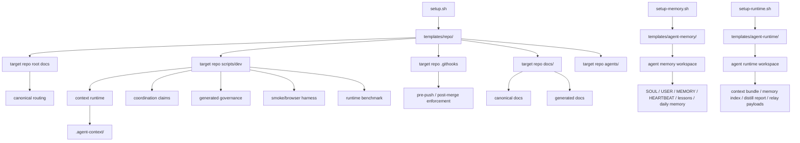

# Kit Architecture

## Goal

The kit exists to turn a repository into an agent-first workspace with:

- a small, stable entry surface
- canonical documentation routing
- reusable agent blueprint routing
- runtime usage telemetry
- semantic runtime memory
- multi-agent ownership control
- queue-level work orchestration
- generated navigation artifacts
- mechanical drift detection
- local evidence capture

## High-Level Layers

## Main Components

### 1. Bootstrap Layer

- `setup.sh`
- `setup-memory.sh`
- `setup-runtime.sh`
- `templates/repo/`
- `templates/agent-memory/`
- `templates/agent-runtime/`

This layer applies the kit into a target repository. It is responsible for:

- copying canonical docs
- copying scripts and hooks
- generating `context-kit.json`
- generating initial product spec files from `--surfaces`
- generating initial agent manifests
- injecting npm scripts into `package.json`
- running initial generated-doc refresh

The optional memory bootstrap is separate. It is responsible for:

- creating an agent-local memory workspace
- writing identity and relationship files
- writing layered long-term memory scaffolding
- creating daily-memory and lessons files
- initializing git in the memory workspace if needed

The optional runtime bootstrap is also separate. It is responsible for:

- creating a platform-specific runtime workspace
- pointing runtime config at a core repo and memory workspace
- generating boot bundles and memory indexes
- generating nightly distill reports
- formatting cross-agent relay payloads
- initializing git in the runtime workspace if needed

### 2. Canonical Docs Layer

Installed files:

- `README.md`
- `AGENTS.md`
- `CLAUDE.md`
- `ARCHITECTURE.md`
- `docs/CONTEXT_ENGINEERING.md`
- `docs/CONTEXT_EVALUATION.md`
- `docs/CONTEXT_PLATFORM.md`
- `docs/CONTEXTUAL_RETRIEVAL.md`
- `docs/AGENT_FACTORY.md`
- `docs/AGENT_OBSERVABILITY.md`
- `docs/MULTI_AGENT_COORDINATION.md`
- `docs/ORCHESTRATION.md`
- `docs/SANDBOX_POLICY.md`
- `docs/README.md`
- `docs/{SYSTEM_INTENT,DESIGN,ENGINEERING,PLANS,PRODUCT_SENSE,QUALITY_SCORE,RELIABILITY,SECURITY,HARNESS}.md`

Purpose:

- keep the agent start surface small
- separate stable authority from working memory
- make product, architecture, and execution rules discoverable in-repo

### 3. Runtime Context Layer

Installed scripts:

- `context-save.sh`
- `context-checkpoint.sh`
- `context-compact.sh`
- `context-restore.sh`
- `check-context-quality.sh`
- `context-auto.sh`
- `context-pin.sh`
- `autopilot-work.mjs`
- `claim-work.mjs`
- `list-work-claims.mjs`
- `check-agent-coordination.mjs`
- `release-work.mjs`
- `orchestration-lib.mjs`
- `orchestrate-work.mjs`
- `list-orchestration-work.mjs`
- `check-orchestration-work.mjs`

Runtime storage:

- `.agent-context/snapshots/`
- `.agent-context/checkpoints/`
- `.agent-context/briefs/`
- `.agent-context/handoffs/`
- `.agent-context/compact/`
- `.agent-context/runtime/`
- `.agent-context/state/`
- `.agent-context/harness/`
- `.agent-context/evaluations/`
- `.agent-context/coordination/`
- `.agent-context/orchestration/`

Purpose:

- preserve semantic task memory outside the transient chat window
- generate fast resume artifacts
- separate durable documentation from per-branch runtime memory
- make parallel ownership visible and machine-checkable
- make work dependencies and ready queues visible without overloading the claim system
- keep session restart flows reproducible without depending on long terminal history

### 4. Generated Governance Layer

Installed scripts:

- `refresh-generated-context.mjs`
- `refresh-doc-governance.mjs`
- `refresh-context-metrics.mjs`
- `refresh-context-registry.mjs`
- `refresh-context-retrieval.mjs`
- `refresh-agent-catalog.mjs`
- `refresh-agent-usage-report.mjs`
- `refresh-context-ab-report.mjs`
- `refresh-sandbox-policy-report.mjs`
- `check-docs-context.sh`

Generated outputs:

- `docs/generated/route-map.md`
- `docs/generated/store-authority-map.md`
- `docs/generated/api-group-map.md`
- `docs/generated/docs-catalog.md`
- `docs/generated/legacy-doc-audit.md`
- `docs/generated/context-contract-report.md`
- `docs/generated/context-efficiency-report.md`
- `docs/generated/context-registry.md`
- `docs/generated/context-registry.json`
- `docs/generated/contextual-retrieval.md`
- `docs/generated/contextual-retrieval-index.json`
- `docs/generated/agent-catalog.md`
- `docs/generated/agent-catalog.json`
- `docs/generated/agent-usage-report.md`
- `docs/generated/agent-usage-report.json`
- `docs/generated/context-ab-report.md`
- `docs/generated/sandbox-policy-report.md`

Purpose:

- reduce navigation cost
- mechanically classify document authority
- detect stale/broken references
- compare surface specs against code/config discovery
- make context savings measurable instead of assumed
- expose a portable discovery manifest for open-source tooling
- expose reusable agent blueprints for outsiders
- expose runtime usage evidence and estimated time-saved summaries
- expose a deterministic query-time retrieval index for ambiguous doc lookups
- make routed-vs-baseline wins visible instead of anecdotal
- make execution boundaries explicit instead of implied

### 5. Enforcement Layer

Installed hooks:

- `.githooks/pre-push`
- `.githooks/post-merge`

Related scripts:

- `install-git-hooks.sh`
- `safe-status.sh`
- `sync-branch.sh`
- `new-worktree.sh`
- `run-configured-command.sh`

Purpose:

- keep context artifacts current
- keep the branch synced with the configured main branch
- gate pushes on docs/context checks and optional project checks/builds

### 6. Harness Layer

Installed scripts:

- `run-context-harness.sh`
- `run-browser-context-harness.sh`
- `run-full-context-harness.sh`
- `run-context-benchmark.mjs`

Purpose:

- capture local smoke evidence
- capture DOM and screenshot evidence
- leave artifacts in `.agent-context/harness/`
- measure runtime variance and infra noise in `.agent-context/evaluations/`

## Authority Model

The kit enforces the following order:

1. canonical root docs
2. canonical docs under `docs/`
3. active plans under `docs/exec-plans/active/`
4. generated docs under `docs/generated/`
5. historical docs under `docs/archive/`
6. runtime memory under `.agent-context/`

That means:

- `.agent-context/` must never become source of truth
- `docs/AGENT_WATCH_LOG.md` is evidence, not primary authority
- active plans may drive in-flight work, but stable rules should be promoted upward

## Generic vs Project-Specific Boundaries

The kit is generic in:

- docs structure
- runtime memory model
- generation/governance workflow
- hook strategy
- harness strategy

The target repository remains project-specific in:

- `context-kit.json`
- `docs/product-specs/*.md`
- any deeper design docs
- project `check`, `build`, or custom `gate` commands
- actual code layout under `src/`
